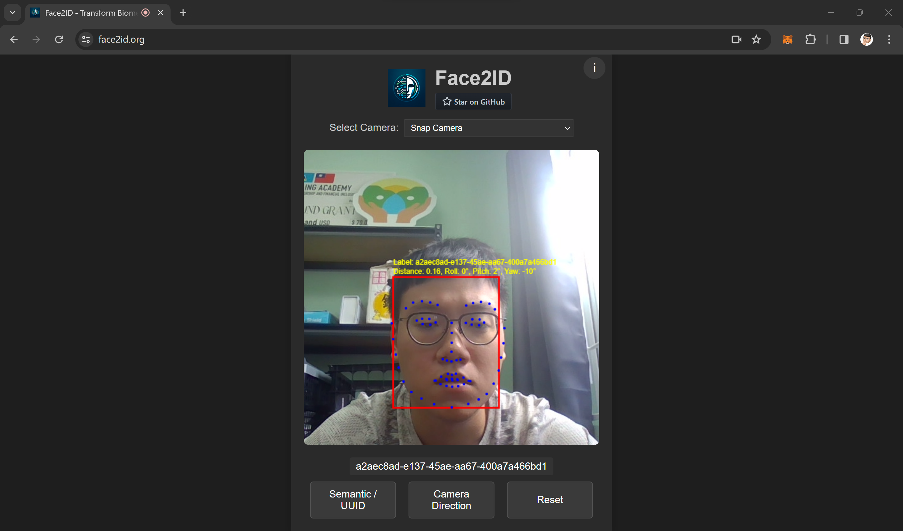

# Face2ID


Saint Lucian hospitals frequently encounter patients lacking official identification, which impedes the reliability of the healthcare system. The current method of recording patient information (first name, last name and date of birth) is prone to human error and potential manipulation, highlighting the need for a more secure and efficient identification system. Face2ID addresses this issue by employing contactless and easily utilizable facial recognition technology to create a biometric hash that serves as a secure and unique identifier for each patient.

## Screenshots

| Desktop (uuid mode)     | Mobile (semantic mode) |
| ----------------------- | ---------------------- |
|  |  |

## Run

### Nodejs
```
npm install
npm start
```

### Docker
```
# Both AMD64 and ARM are supported
docker run --name face2id ruisiang/face2id
```
